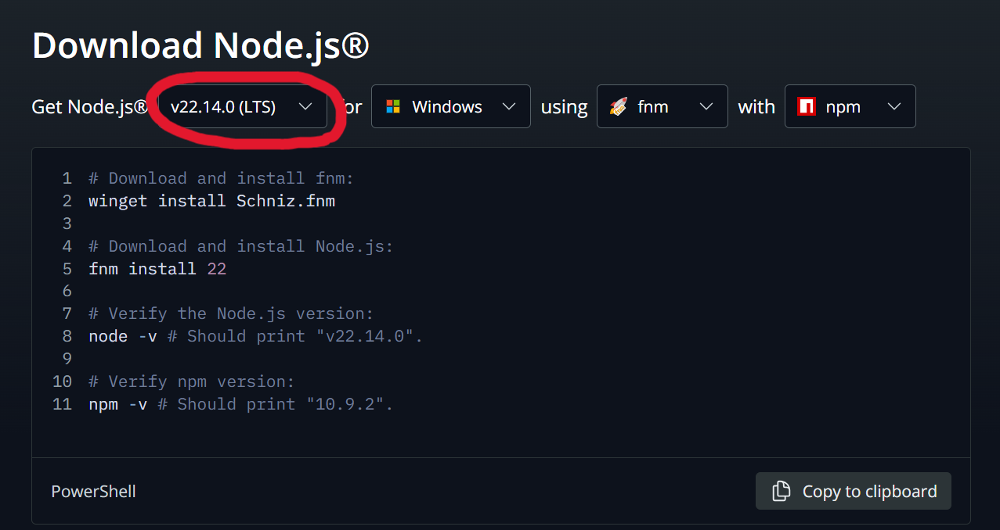
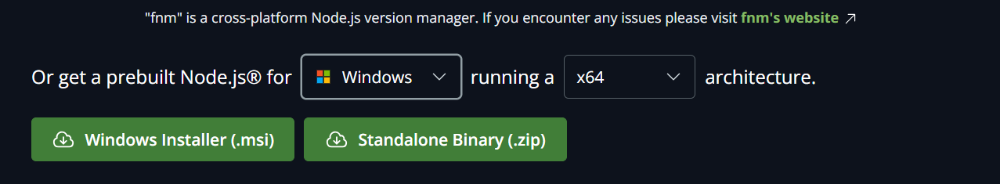
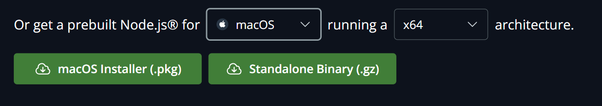

# Data Science Club Website

This is primarily a React project, built with Node.js and TailwindCSS, created for our sister club, the Data Science Club. The website is designed to showcase the Data Science Club of Skyline College and introduce the world to what they do and who they are.

---

## Table of Contents

- [Installation](#installation)
- [Usage](#usage)

---

## Setup & Guide

### **1.** **Install Node.Js**

Before you begin, ensure you have Node.js installed on your machine.
You can download it from the [official Node.js website](https://nodejs.org/en/download).<br>
From there, get a prebuilt Node.Js for your system.<br>
**Please make sure you are using Node.js version 22.14.0 (LTS).** This is the standardized version for this project, chosen for its stability and long-term support (LTS), which ensures reliability and compatibility throughout development.
<br>
Then, just download the installer, and install Node.Js

Or, for mac:


Check if you have npm installed by running this on your command line:

```bash
npm - v
```

Although we are not using Node.Js for this project, we will still be using the package manager that comes with it, **npm**.

### **2.** **Cloning The Repository**

Clone this repository locally to your computer using [Git](https://git-scm.com/downloads).<br>
Make a directory where you'll be working on the Data Science Club Website.<br>
Then, start by clicking the green <> Code button above, copying the URL, and putting the url inside:

```bash
git clone <repository_url>
```

Move to the repository directory by:

```bash
cd <repository_name>
```

### **3.** **Installing Dependencies**

Once inside the project directory, install the required dependencies by running:

```bash
npm install
```

This will install all the necessary packages listed in `package.json`.

## Usage

This is a [Next.js](https://nextjs.org) project bootstrapped with [`create-next-app`](https://nextjs.org/docs/app/api-reference/cli/create-next-app).

First, run the development server:

```bash
npm run dev
# or
yarn dev
# or
pnpm dev
# or
bun dev
```

Open [http://localhost:3000](http://localhost:3000) with your browser to see the result.

The page auto-updates as you edit the file.

### **Making Changes And Committing Code**

If you make changes, follow these steps:

```bash
git checkout -b feature-branch  # Create a new branch
git add .                       # Stage changes
git commit -m "Description of changes"  # Commit changes
git push origin feature-branch  # Push to GitHub
```

## Learn More

To learn more about Next.js, take a look at the following resources:

- [Next.js Documentation](https://nextjs.org/docs) - learn about Next.js features and API.
- [Learn Next.js](https://nextjs.org/learn) - an interactive Next.js tutorial.

You can check out [the Next.js GitHub repository](https://github.com/vercel/next.js) - your feedback and contributions are welcome!
